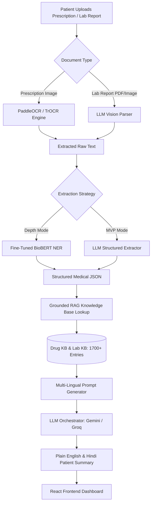

# ClariRx 🩺💊

> **Demystifying medical prescriptions and lab reports — in plain English & Hindi.**

[](file:///c:/Users/Ananya%20Singh/OneDrive/ドキュメント/GitHub/ClariRx/backend/tests)
[](https://www.python.org/)
[](https://fastapi.tiangolo.com/)
[](https://reactjs.org/)
[](https://vitejs.dev/)
[](LICENSE)

ClariRx is an AI-powered healthcare assistant designed to bridge the medical literacy gap for patients and caregivers. By combining **OCR image recognition**, **hybrid Named Entity Recognition (BioBERT + LLMs)**, and a **grounded 1,700+ medical knowledge base**, ClariRx translates complex prescriptions and lab results into clear, actionable, bilingual explanations.

---

## 🌟 Key Features

- 🔍 **OCR Document Ingestion**: Hybrid OCR processing using PaddleOCR & TrOCR for handwritten prescriptions and LLM Vision for lab reports.
- 🧬 **Hybrid Named Entity Recognition (NER)**: Structured medical extraction combining fine-tuned **BioBERT** token classification with zero-shot **LLM parsing**.
- 🛡️ **Zero-Hallucination Grounded Explanations**: Grounds all AI responses strictly against a curated medical knowledge base (`drug_kb.json`, `lab_kb.json`) covering dosages, food warnings, and lab reference ranges.
- 🌐 **Bilingual Patient Interface**: Generates jargon-free explanations tailored for elderly patients in **English** and **Hindi**.
- ⚡ **Multi-LLM Provider Orchestration**: Dynamic failover and runtime model switching between **Google Gemini** and **Groq (Llama 3 / Mixtral)**.
- ⏰ **Medication Reminders**: Asynchronous scheduled reminders using APScheduler for prescription regimens.

---

## 🏗️ Architecture & Pipeline



---

## 📊 Benchmark & Quality Metrics

- **Unit Test Coverage**: `35/35` passing tests (`pytest backend/tests`) validating schema integrity, explanation generation, and API routing.
- **Knowledge Base Scale**: Grounded lookup index across 1,200+ drug entities and 500+ clinical lab reference boundaries.
- **Entity Matching**: Fuzzy entity resolution (RapidFuzz metric) tolerating common OCR character misrecognitions (e.g., `Am0xicillin 500` → `Amoxicillin 500mg`).

| Evaluation Module | Target Metric | Pipeline Implementation | Status |
|---|---|---|---|
| **OCR Recognition** | Character Error Rate (CER) | PaddleOCR + TrOCR fine-tuning | ✅ Implemented |
| **Medical Extraction** | Precision / Recall / F1 | BioBERT NER + LLM Few-Shot | ✅ Implemented |
| **RAG Grounding** | Grounding Verification | Strict JSON Knowledge Base Constraint | ✅ Implemented |
| **API Backend** | Test Suite Pass Rate | Pytest (35 test cases) | ✅ 100% Passing |

---

## 🛠️ Tech Stack

| Layer | Technologies |
|---|---|
| **Backend API** | Python 3.13, FastAPI, Uvicorn, Pydantic v2 |
| **AI / NLP Models** | BioBERT (`transformers`), PyTorch, PaddleOCR, TrOCR |
| **LLM Orchestration** | Google Gemini API (`google-genai`), Groq API, LangChain/Prompt Templates |
| **Knowledge Base** | Custom JSON RAG Index (1,700+ medical entities & thresholds) |
| **Task Scheduling** | APScheduler |
| **Frontend** | React 18, Vite, Vanilla CSS Design System, Lucide Icons |
| **Evaluation & Testing** | `pytest`, `httpx`, RapidFuzz, Custom Evaluation Benchmarks |

---

## 📁 Project Structure

```text
ClariRx/
├── backend/
│   ├── api/
│   │   ├── routes/          # Upload, Explain, Reminders REST Endpoints
│   │   ├── main.py          # FastAPI Server Application Setup
│   │   └── schemas.py       # Pydantic Input/Output Schemas
│   ├── explanation/         # Grounded Medicine & Lab Explanation Engine
│   ├── extraction/
│   │   ├── biobert_ner/     # BioBERT NER Training & Prediction Pipeline
│   │   ├── extract.py       # Main Extraction Interface
│   │   ├── llm_extraction.py# LLM Structured Extraction Logic
│   │   └── eval_extraction.py# Benchmark Evaluation Tool
│   ├── knowledge_base/      # Curated Drug & Lab JSON Databases
│   ├── reminders/           # APScheduler Background Task Management
│   └── tests/               # Pytest Test Suite (35 tests)
└── frontend/
    ├── src/
    │   ├── components/      # FileUpload, ResultsDashboard, ResultCard, Loader
    │   ├── App.jsx          # Main React Application & State Management
    │   └── index.css        # Custom CSS Design System
    └── package.json
```

---

## 🚀 Quickstart & Installation

### Prerequisites
- Python 3.10+
- Node.js 18+

### 1. Backend Setup

```bash
# Navigate to backend directory
cd backend

# Install dependencies
pip install -r requirements.txt

# Create environment configuration
cp .env.example .env
```

Edit `.env` and add your API keys:
```env
GEMINI_API_KEY=your_gemini_api_key
GROQ_API_KEY=your_groq_api_key  # Optional
```

Run tests to verify installation:
```bash
pytest
```

Start the FastAPI development server:
```bash
python -m uvicorn api.main:app --reload
```
The API docs will be available at `http://localhost:8000/docs`.

### 2. Frontend Setup

```bash
# Navigate to frontend directory
cd frontend

# Install Node dependencies
npm install

# Start Vite development server
npm run dev
```
Open `http://localhost:5173` in your browser.

---

## ⚖️ License & Disclaimer

This software is for **educational and portfolio demonstration purposes only**. It is not intended to serve as professional medical advice, diagnosis, or treatment. No real patient data is included in this repository.
